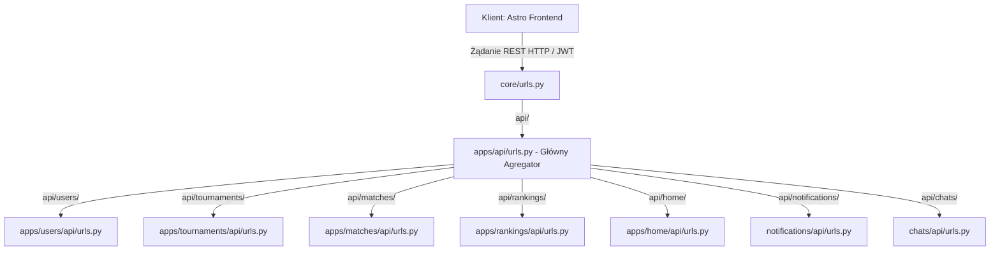

# Opis zmian: Refaktoryzacja API i przejście na architekturę Headless (Astro-first)

**Data sporządzenia:** 17 maja 2026 r.  
**Autor:** Lucjan  
**Status zmiany:** Ukończona i zweryfikowana  

---

## 1. Kontekst i Motywacja (Dlaczego to zrobiliśmy?)

Dotychczas cały system zmagał się z istotnym długiem technologicznym: cała logika REST API (widoki, serializatory, routing) dla wszystkich domen biznesowych (turnieje, mecze, użytkownicy, rankingi, czaty) znajdowała się w jednym, monolitycznym pakiecie `apps/api/`. 

Prowadziło to do kilku poważnych problemów:
1. **Złamanie zasady Separation of Concerns (Rozdzielenie Odpowiedzialności)**: Zmiana w logice turniejów wymagała modyfikacji plików w globalnym pakiecie `apps/api/`, co zwiększało ryzyko konfliktów scalania (merge conflicts) i błędów regresji.
2. **Brak hermetyzacji (Cohesion)**: Moduły domenowe (np. `apps/tournaments/`) były niekompletne – ich baza danych (modele) leżała w jednym miejscu, a interfejs komunikacyjny (API) w zupełnie innym.
3. **Mieszanie kodu aktywnego z Legacy**: Ponieważ frontend aplikacji został w 100% przeniesiony do nowoczesnej aplikacji **Astro**, stare widoki Django HTML, tradycyjne formularze oraz szablony `.html` wewnątrz domen stały się martwym kodem (Legacy). Bez wyraźnego oddzielenia deweloperzy i agenci AI gubili się w tym, które pliki są produkcyjnie aktywne.

---

## 2. Nowa Architektura (Domain-Driven Design)

Zastosowaliśmy podejście modułowe, w którym każda domena biznesowa jest w pełni samodzielna (self-contained). Przenieśliśmy logikę API bezpośrednio do dedykowanych aplikacji:



Dzięki temu deweloper pracujący np. nad turniejami ma kompletny zestaw narzędzi w jednym katalogu `apps/tournaments/`:
*   `models.py` — baza danych.
*   `api/serializers.py` — struktura i walidacja danych JSON dla Astro.
*   `api/views.py` — logika biznesowa punktów końcowych.
*   `api/urls.py` — wewnętrzny routing.
*   `bracket.py` / `swiss_logic.py` — silnik algorytmiczny.

---

## 3. Szczegółowy wykaz wykonanych prac

### A. Wydzielenie i oczyszczenie API
*   **Stworzenie podmodułów API**: Wewnątrz katalogów `users`, `tournaments`, `matches`, `rankings`, `home`, `notifications` oraz `chats` utworzyliśmy pakiety `api/` wraz z plikami `serializers.py`, `views.py` i `urls.py`.
*   **Przeniesienie logiki**: Przeprowadziliśmy bezpieczną migrację wszystkich klas widoków DRF oraz serializatorów z `apps/api/` do nowo powstałych modułów, dbając o zachowanie wszystkich dekoratorów bezpieczeństwa, uprawnień (permissions) i obsługi wyjątków.
*   **Całkowite usunięcie starych plików**: Aby uniknąć zjawiska "martwych dusz" w repozytorium, całkowicie skasowaliśmy pliki `apps/api/views.py` oraz `apps/api/serializers.py`.
*   **Stworzenie Agregatora API**: Plik `apps/api/urls.py` został uproszczony do roli lekkiego routera delegującego ruch za pomocą metody `include()`:
    ```python
    urlpatterns = [
        path('auth/', include('apps.users.api.urls')),
        path('tournaments/', include('apps.tournaments.api.urls')),
        path('matches/', include('apps.matches.api.urls')),
        path('rankings/', include('apps.rankings.api.urls')),
        path('dashboard/', include('apps.home.api.urls')),
        path('notifications/', include('notifications.api.urls')),
        path('chats/', include('chats.api.urls')),
    ]
    ```

### B. Oznaczenie i separacja kodu Legacy (Django Frontend)
Wszystkie tradycyjne pliki frontendowe Django, które nie biorą już udziału w obsłudze ruchu ze względu na wdrożenie Astro, zostały zaklasyfikowane jako **Legacy / Nieużywane**:
*   Tradycyjne `views.py` (renderujące szablony HTML)
*   Tradycyjne `forms.py` (formularze Django)
*   Tradycyjne `urls.py` (routing HTML)
*   Foldery `templates/*.html` oraz zasoby statyczne `static/` wewnątrz aplikacji.


---

## 4. Status plików tradycyjnych (Legacy)

Stare, tradycyjne pliki aplikacji Django (widoki `views.py`, routingi `urls.py`, formularze `forms.py`, szablony HTML w katalogach `templates/` oraz powiązane pliki statyczne) pozostaną w strukturze katalogów **wyłącznie do czasu pełnego zakończenia migracji całego systemu na ASTRO + TAILWIND CSS**. Po ostatecznym wdrożeniu i zatwierdzeniu nowego frontendu, wszystkie powyższe komponenty legacy zostaną całkowicie usunięte z bazy kodu w celu pełnego uproszczenia projektu.
